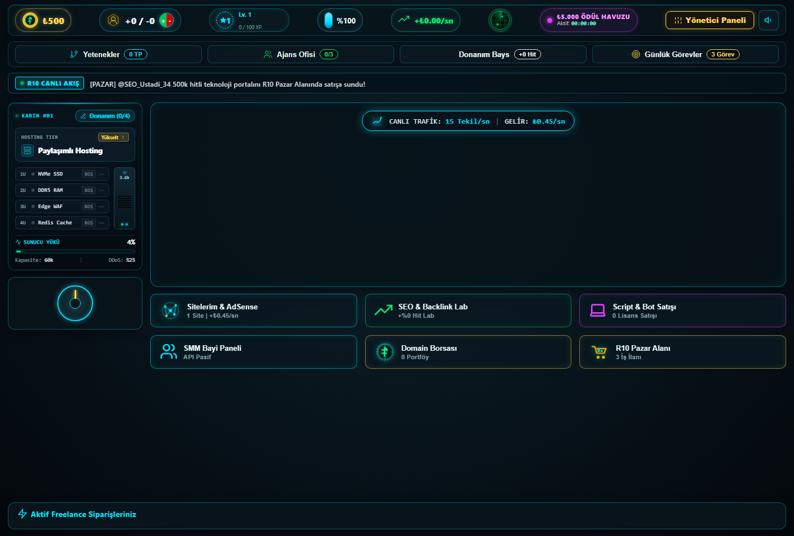
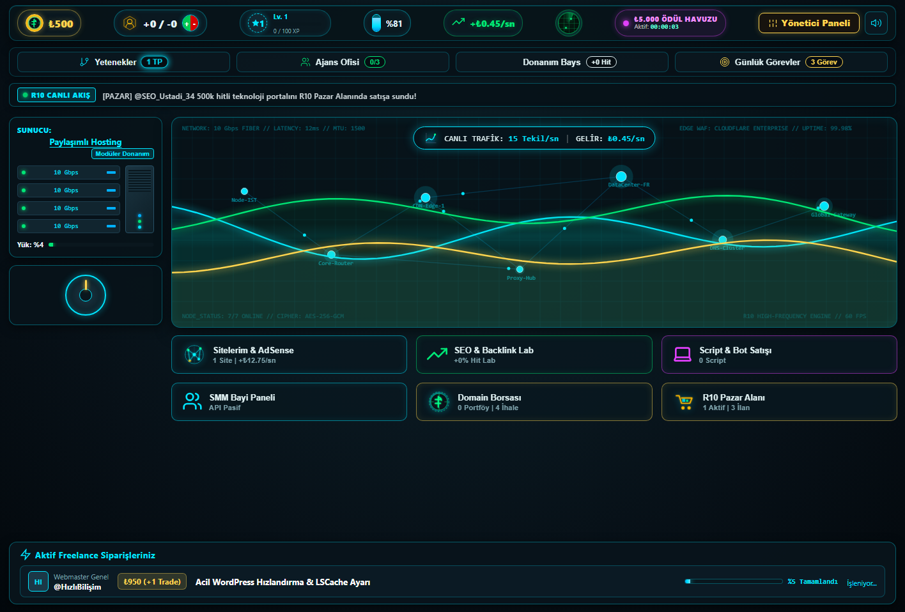
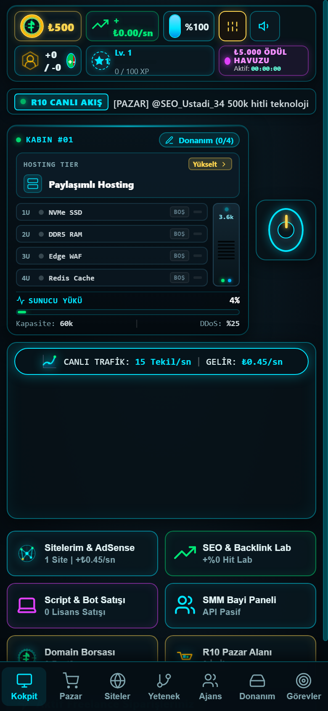
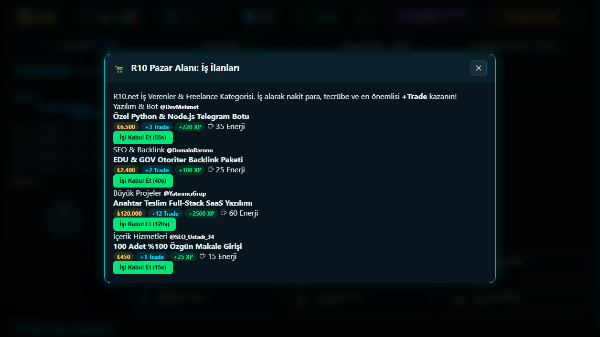
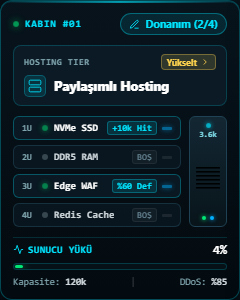
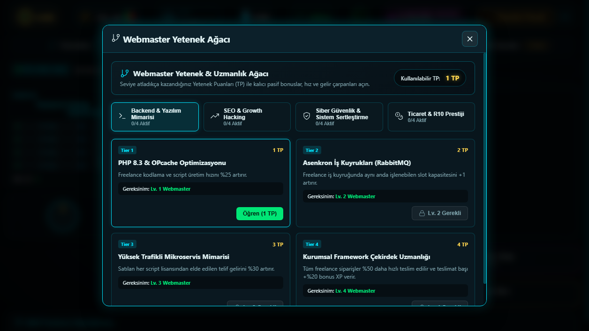
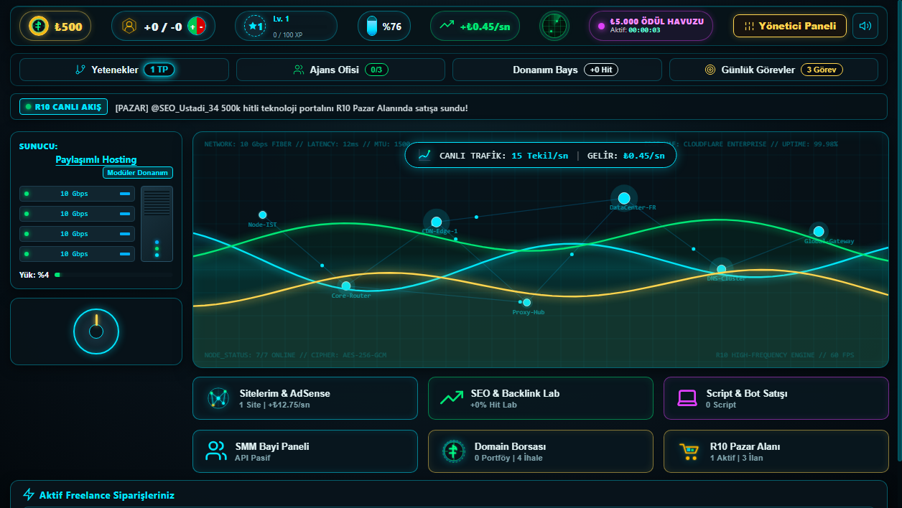

# R10 Webmaster Tycoon

  
  
<em>Gelişmiş Webmaster Simülasyonu - R10.net'in ruhunu yaşayın!</em>

## 🇹🇷 Türkçe 

R10 Webmaster Tycoon, tarayıcı üzerinden oynanabilen, gerçek zamanlı bir dijital ajans ve webmaster simülasyon oyunudur. Sıfırdan başlayarak siteler kurun, sunucularınızı yönetin, SEO paketleri alın ve R10 üzerinden freelance işler yaparak Türkiye'nin en büyük webmaster'ı olun.

### 📸 Oyun İçi Görüntüler

<table>
  <tr>
    <td align="center"><b>🖥️ Masaüstü HUD Arayüzü</b> </td>
    <td align="center"><b>📱 Mobil Arayüz</b> </td>
  </tr>
  <tr>
    <td align="center"><b>🛒 R10 İş & Ticaret Pazarı</b> </td>
    <td align="center"><b>⚙️ Sunucu & Donanım Yönetimi</b> </td>
  </tr>
  <tr>
    <td align="center"><b>🧠 Yetenek Ağacı (Talents)</b> </td>
    <td align="center"><b>💼 Freelance Sipariş Paneli</b> </td>
  </tr>
</table>

### Öne Çıkan Özellikler
- **Gerçek Zamanlı Ekonomi & Pasif Gelir**: Siteleriniz üzerinden anlık TBM (Tıklama Başına Maliyet) ve organik hit üzerinden para kazanın.
- **Freelance & Görev Sistemi**: R10 Job Market üzerinden çeşitli dijital pazarlama, yazılım ve tasarım işleri alarak XP ve Trade puanı toplayın.
- **Dinamik Kriz ve Etkinlikler**: Google Core Güncellemeleri, DDoS saldırıları, AdSense TBM patlamaları ve Düşen Domain açık artırmaları gibi rastgele global olaylara müdahale edin.
- **Personel ve Ajans Yönetimi (Otomasyon)**: Junior Developer, SEO Editor ve SysAdmin kiralayarak iş süreçlerini otomatikleştirin ve sunucu yükünü hafifletin.
- **Sıfır Bağımlılık (Zero Dependency)**: Backend tamamen saf Node.js ile (hiçbir npm paketi olmadan) yazılmış olup JSON tabanlı veritabanı motoru içerir.
- **Gelişmiş Hile Koruması (Anti-Cheat)**: AFK algılama, Tab-Blur dondurma ve sunucu taraflı yetkilendirme ile haksız kazancın önüne geçilmiştir.
- **Gelişmiş Reklam & Sponsorluk Sistemi**: Admin panel üzerinden Rewarded Video (Ödüllü Reklamlar) ve Statik Banner entegrasyonu (Canlı panel üzerinden yönetilebilir).
- **Canlı Admin & God-Mode Paneli**: Yöneticilerin canlı kriz tetikleyebildiği, reklam ayarlarını değiştirebildiği, kullanıcı hesaplarını anlık manipüle edebildiği güvenli yönetim konsolu.

---

## 🇬🇧 English

R10 Webmaster Tycoon is a real-time digital agency and webmaster simulation game built for the browser. Start from scratch, build websites, manage server loads, purchase SEO packages, and complete freelance jobs on the R10 board to become the ultimate webmaster.

### 📸 Gameplay Screenshots

<table>
  <tr>
    <td align="center"><b>🖥️ Desktop HUD Interface</b> </td>
    <td align="center"><b>📱 Mobile Interface</b> </td>
  </tr>
  <tr>
    <td align="center"><b>🛒 R10 Job & Trade Market</b> </td>
    <td align="center"><b>⚙️ Server & Hardware Management</b> </td>
  </tr>
  <tr>
    <td align="center"><b>🧠 Skill Tree (Talents)</b> </td>
    <td align="center"><b>💼 Freelance Active Orders</b> </td>
  </tr>
</table>

### Key Features
- **Real-Time Economy & Passive Income**: Earn money dynamically based on CPC (Cost Per Click) and organic traffic from your portfolio of sites.
- **Freelance & Job Market**: Accept digital marketing, software, and design contracts via the R10 Job Market to earn XP and Trade score.
- **Dynamic Crises & Events**: React to random global events like Google Core Updates, DDoS attacks, AdSense CPC Booms, and Expired Domain Auctions.
- **Agency & Staff Management (Automation)**: Hire Junior Developers, SEO Editors, and SysAdmins to automate workflows and reduce server overhead.
- **Zero Dependency Architecture**: The backend is written in pure Node.js (without any npm dependencies) utilizing a custom JSON-based flat-file database engine.
- **Advanced Anti-Cheat**: Prevents unfair advantages using AFK detection, Tab-Blur freezing, and server-side authority locks.
- **Advanced Ad & Sponsorship System**: Rewarded Video and Static Banner integration manageable via the live admin console.
- **Live Admin & God-Mode Console**: Secure command center for administrators to trigger live crises, update ad settings, and inject player stats in real-time.

---

## Contact / İletişim & Geliştirici
**Telegram:** [@luanamobile](https://t.me/luanamobile)
